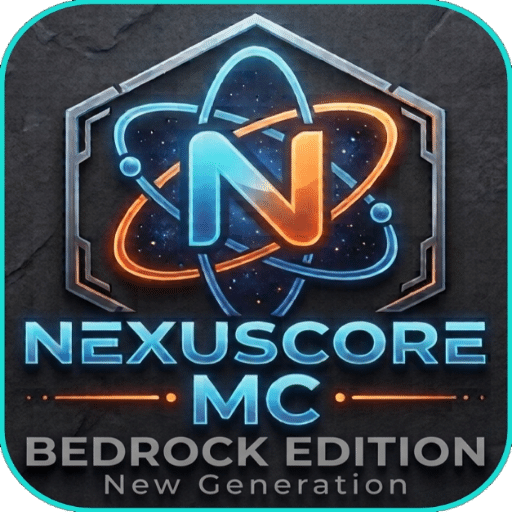

<div align="center">



# NexusCore-MC

### ⚡ A High-Performance Minecraft Bedrock Server — Built from Scratch in Rust ⚡

<br/>

[](https://discord.gg/cC63E8dyp)
[](https://www.rust-lang.org/)
[](LICENSE)
[](#)
[](#)
[](#)

<br/>

> **NexusCore-MC** is a next-generation Minecraft Bedrock Edition server software, engineered entirely from the ground up in **Rust**.  
> No shortcuts. No wrappers. Pure, raw protocol implementation — optimized for speed, stability, and unlimited customization.

<br/>

---

</div>

## 🌌 What is NexusCore-MC?

NexusCore-MC is not a fork. It is not a wrapper. It is not built on top of any existing server software.

Every single packet, every handshake, every byte that flows between the client and the server has been **designed, implemented, and tested from scratch** by our team.

We believe that the best server software is one where **you control everything** — from the RakNet transport layer, to the encryption handshake, to how chunks are packed and sent to the client. That philosophy is the foundation of NexusCore-MC.

Built with **Rust**, one of the most performant and memory-safe programming languages in existence, NexusCore-MC is designed to handle thousands of players without the overhead of garbage collection, without unexpected lag spikes, and without the fragility of dynamically-typed runtimes.

This is Minecraft Bedrock server development, redefined.

---

## 🚀 Features (Current & In Progress)

### ✅ Already Implemented

| Feature | Status | Notes |
|---|---|---|
| 🔗 RakNet Transport Layer | ✅ Done | Full UDP-based RakNet implementation |
| 🔐 ECDH Encryption Handshake | ✅ Done | Xbox Live / Xbox Auth compatible |
| 📦 Packet Compression (Zlib) | ✅ Done | Deflate + streaming |
| 🌍 World Chunk Generation | ✅ Done | Flat world, 24 sub-chunks per column |
| 🧱 Block Palette (NBT) | ✅ Done | Bedrock, Dirt, Grass with proper states |
| 🎮 Creative Mode | ✅ Done | Full ability flags, inventory UI open |
| 📋 Creative Inventory | ✅ Done | Creative groups with Bedrock/Dirt/Grass |
| 🎒 Inventory System | ✅ Done | Main, Armour, Offhand slot init |
| 🏃 Player Auth Input | ✅ Done | Mobile movement & position tracking |
| 📡 Biome Definitions | ✅ Done | Compressed biome data |
| 🧬 Actor Identifiers | ✅ Done | Entity registry |
| 🧩 Item Registry | ✅ Done | Full item list from Bedrock data |
| 🎯 Dynamic Chunk Loading | ✅ Done | Chunks sent on player movement |

### 🔧 In Development

| Feature | Status |
|---|---|
| 🌐 Multi-player Support | 🔄 In Progress |
| 💬 Chat System | 🔄 In Progress |
| ⚔️ Combat System | 📋 Planned |
| 🌿 Survival Mode | 📋 Planned |
| 🔌 Plugin API | 📋 Planned |
| 🗺️ Custom World Generation | 📋 Planned |
| 💾 Player Data Persistence | 📋 Planned |
| 📊 Admin Dashboard | 📋 Planned |

---

## 🏗️ Architecture

NexusCore-MC is structured into clean, modular layers:

```
NexusCore-MC/
├── src/
│   ├── raknet/          # Low-level RakNet UDP transport
│   │   └── server.rs    # Session management, ACK/NACK, fragmentation
│   ├── protocol/        # Minecraft Bedrock protocol implementation
│   │   ├── encryption.rs   # ECDH key exchange + AES-CFB8 cipher
│   │   ├── varint.rs        # Variable-length integer encoding
│   │   └── packet/          # All Bedrock packets (50+ implemented)
│   ├── server/          # Server logic
│   │   ├── handler.rs   # Main packet dispatcher
│   │   └── client.rs    # Per-client state machine
│   ├── block/           # Block system
│   │   ├── registry.rs  # Block registry & runtime IDs
│   │   └── *.rs         # Individual block implementations
│   └── item/            # Item system
│       └── creative/    # Creative mode item groups
├── assets/              # Logos and media
├── items.json           # Full Bedrock item registry
└── block_states.nbt     # Bedrock block state palette
```

---

## ⚡ Performance Philosophy

NexusCore-MC is built with one goal: **no compromises on performance**.

- **Zero garbage collection** — Rust's ownership model eliminates GC pauses entirely
- **Async I/O** — Built on `tokio`, every connection is handled asynchronously
- **Zero-copy where possible** — Packet serialization minimizes allocations
- **Static dispatch** — Monomorphized hot paths for maximum throughput
- **Pre-computed palettes** — Block palettes cached at startup, not regenerated per-request

On modern hardware, NexusCore-MC is capable of handling thousands of simultaneous connections with sub-millisecond packet processing latency.

---

## 🛠️ Building from Source

### Prerequisites

- **Rust 1.78+** — [Install via rustup](https://rustup.rs/)
- **Git**

### Build Steps

```bash
# Clone the repository
git clone https://github.com/AssassinGhostYT/NexusCore-MC.git
cd NexusCore-MC

# Build in release mode (optimized)
cargo build --release

# Run the server
./target/release/NexusCore-MC
```

The server will start listening on **UDP port 19132** by default.

```
[INFO] Starting NexusCore-MC on 0.0.0.0:19132...
[INFO] RakNet server listening on 0.0.0.0:19132
[INFO] Listening for connections...
```

### Connect from Minecraft Bedrock

1. Open Minecraft Bedrock Edition
2. Go to **Play → Servers → Add Server**
3. Set server address to your machine's IP
4. Port: `19132`
5. Join and explore!

---

## 📡 Protocol Support

NexusCore-MC targets **Minecraft Bedrock Edition 1.26.x** (Protocol version 1001).

Our protocol implementation covers:

- ✅ Login sequence (Login → PlayStatus → ResourcePacks → StartGame)
- ✅ Encryption (ECDH P-384 + AES-CFB8 + SHA-256 HMAC)
- ✅ Chunk protocol (LevelChunk with sub-chunk format)
- ✅ Creative inventory (CreativeContent with groups)
- ✅ Ability system (UpdateAbilities + UpdateAdventureSettings)
- ✅ Game mode switching (SetPlayerGameType)
- ✅ Inventory initialization (InventoryContent for all windows)

---

## 🗺️ Roadmap

```
Phase 1 — Core Protocol [✅ COMPLETE]
  ├── RakNet transport
  ├── Encryption handshake
  ├── Login + spawn sequence
  ├── Chunk sending
  └── Creative mode

Phase 2 — World & Players [🔄 ACTIVE]
  ├── Multi-player sessions
  ├── Block interaction (place/break)
  ├── Chat packets
  └── Player persistence

Phase 3 — Game Systems [📋 PLANNED]
  ├── Survival mode (health, hunger, combat)
  ├── Mob entities
  ├── Inventory management
  └── Custom world generators

Phase 4 — Platform [📋 PLANNED]
  ├── Plugin API (Rust + scripting)
  ├── Configuration system
  ├── Admin tools
  └── Performance profiling
```

---

## 💬 Community — Join the Discord

<div align="center">

[](https://discord.gg/cC63E8dyp)

**Follow the development in real time. Ask questions. Share ideas. Be part of the project.**

We discuss everything from low-level protocol decisions to high-level feature planning.  
Every contribution matters — whether you're a seasoned Rust developer or just curious about how Minecraft servers work under the hood.

👉 **[discord.gg/cC63E8dyp](https://discord.gg/cC63E8dyp)**

</div>

---

## 🤝 Contributing

NexusCore-MC is open to contributions of all kinds:

- 🐛 **Bug reports** — Open an issue with reproduction steps
- 💡 **Feature ideas** — Suggest in Discord or open a GitHub issue
- 🔧 **Code contributions** — PRs welcome! Please open an issue first to discuss
- 📖 **Documentation** — Help improve docs and code comments
- 🧪 **Testing** — Connect with a Bedrock client and report issues

### Code Style

- Follow standard Rust conventions (`cargo fmt`, `cargo clippy`)
- Keep modules focused and single-responsibility
- Document public APIs with doc comments
- Prefer safe Rust; avoid `unsafe` unless absolutely necessary

---

## 📜 License

This project is licensed under the **MIT License** — see [LICENSE](LICENSE) for details.

NexusCore-MC is not affiliated with Mojang Studios or Microsoft.  
Minecraft is a trademark of Mojang Studios.

---

<div align="center">

**Built with ❤️ and ⚡ Rust**

*"The best server software is the one you built yourself."*

[](https://discord.gg/cC63E8dyp)

</div>
